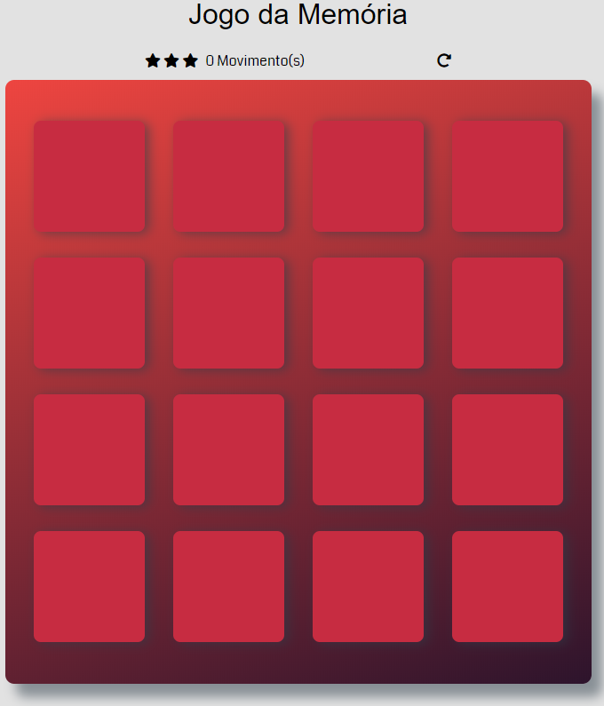

# Jogo da Memória

## Geral

Projeto Final do Nanodegree de Front-End da Udacity

- Prévia do jogo

## Como o jogo funciona

O tabuleiro do jogo é composto por dezesseis "cartas" dispostas em uma grade. O baralho é composto por oito pares diferentes de cartas, cada uma com
símbolos diferentes de um lado. As cartas são dispostas aleatoriamente na grade com o símbolo voltado para baixo. As regras de jogo são muito
simples: clique em dois cartões escondidos de cada vez para localizar os que combinam!

Cada turno:

- O jogador clica em uma carta para revelar seu símbolo e isso será contabilizado com 1 movimento.
- O jogador clica em uma segunda carta, tentando encontrar se a carta correspondente ao mesmo símbolo e isso será contabilizado com mais 1 movimento.
- Se as cartas coincidirem, ambas as cartas permanecerão viradas.
- Se as cartas não coincidirem, ambas as cartas serão viradas pra baixo novamente.

A classificação das estrelas depende do número de movimentos:

- :star::star::star: Se os movimentos estiverem entre 8 e 11.
- :star::star: Se os movimentos estiverem entre 12 e 19.
- :star: Se os movimentos forem 20 ou mais.

O jogo termina quando todas as cartas forem correspondidas corretamente.
O jogador pode reiniciar o jogo a qualquer momento clicando no ícone de reinicialização.
